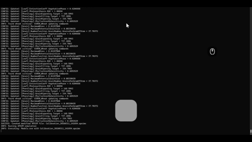

# OmniCurtain

OmniCurtain is a small AutoHotkey script for Windows that hides the currently active window and lets you restore one or more hidden apps from the system tray.

It supports multiple apps. Clicking the tray icon restores the last app you hid, so apps are restored in reverse order of minimization.

It is useful when you want to quickly hide a PowerShell window or another app without closing it.

OmniCurtain hides apps without closing them, so your workflow stays intact, but hidden apps still use system resources while they remain open.

## Requirements

- Windows
- AutoHotkey v1

Install AutoHotkey from the official website:

- [AutoHotkey website](https://www.autohotkey.com/)
- [Official AutoHotkey GitHub releases](https://github.com/AutoHotkey/AutoHotkey/releases)

This script uses AutoHotkey v1 syntax, so Windows users should install a v1-compatible AutoHotkey release before running `omnicurtain.ahk`.

## How to use

1. Install AutoHotkey on Windows.
2. Double-click `omnicurtain.ahk` to start the script.
3. Open the app you want to hide.
4. Press `Win + Ctrl + Down` to hide the active window to the tray.
5. Repeat on other apps if you want to hide multiple windows.
6. Double-click the tray icon to restore the most recently hidden window, or use the tray menu to restore a specific hidden app.

This is especially handy for PowerShell, terminal windows, and other apps you want out of sight without closing them.

## What it does

- Hides the currently active window
- Supports multiple hidden apps at the same time
- Restores the last hidden app first when you click the tray icon
- Lists hidden windows in the tray menu so you can restore a specific one

## Files

- `omnicurtain.ahk`: main AutoHotkey script
- `LICENSE`: MIT license
- `SECURITY.md`: security and safe-install notes

## License

Released under the MIT License. See [LICENSE](LICENSE).

A star or any appreciation is always welcome.
